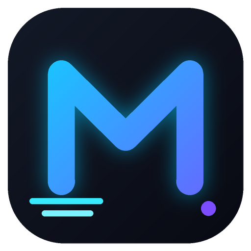
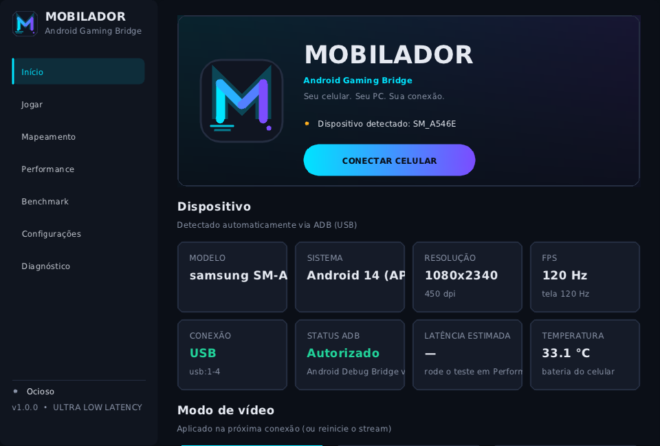

<p align="center"></p>
<h1 align="center">MOBILADOR</h1>
<p align="center"><b>Android Gaming Bridge</b><br>Seu celular. Seu PC. Sua conexão.</p>

Aplicativo desktop para Windows que espelha a tela de um Android **via USB** com a menor latência que conseguimos medir, e controla o jogo com **teclado e mouse** usando mapeamento para multi-touch.



- Streaming H.264/H.265/AV1 com encoder de hardware no celular e decodificação D3D11VA no PC
- Fila de 1 frame (sempre o mais recente), sem fila de pacotes, sem VSync no modo ULTRA LOW LATENCY
- Input enviado na hora (mensagem de 32 bytes, TCP_NODELAY) → `MotionEvent` multi-touch nativo
- Editor visual de mapeamento sobre a tela real: botão, joystick, toque, câmera, mira, swipe, área de movimento, combinações
- Mouse para FPS com Raw Input: sensibilidade, multiplicadores X/Y, aceleração, deadzone, inversão
- **MOBILADOR PERFORMANCE**, **LATENCY ANALYZER** e **teste ponta a ponta real**
- **MOBILADOR BENCHMARK** comparando configurações A/B/C, com exportação CSV
- Reconexão automática, logs, diagnóstico, tema escuro/claro, escala da interface, DPI por monitor

Arquitetura detalhada e análise de latência: **[docs/ARCHITECTURE.md](docs/ARCHITECTURE.md)**.

## 1. Preparar o Android

1. *Configurações → Sobre o telefone* → toque 7× em **Número da versão**.
2. *Opções do desenvolvedor* → ative **Depuração USB**.
3. Xiaomi/POCO: ative também **Depuração USB (configurações de segurança)** (necessário para injetar toques).
4. Conecte o cabo e aceite a chave RSA ("Sempre permitir deste computador").
5. Para o teste ponta a ponta: ative **Mostrar toques** (ou marque em *Configurações → Conexão* no Mobilador).

## 2. Compilar (Windows 10/11 x64)

Requisitos: Visual Studio 2022 (C++ Desktop), CMake ≥ 3.21, Git, PowerShell.

```powershell
git clone https://github.com/microsoft/vcpkg C:\vcpkg
C:\vcpkg\bootstrap-vcpkg.bat
./tools/fetch_deps.ps1      # scrcpy-server 3.1 + Android platform-tools em third_party/
cmake -S . -B build -G "Visual Studio 17 2022" -A x64 `
      -DCMAKE_TOOLCHAIN_FILE=C:/vcpkg/scripts/buildsystems/vcpkg.cmake -DVCPKG_TARGET_TRIPLET=x64-windows
cmake --build build --config Release
build\Release\Mobilador.exe
```

O vcpkg instala SDL2, FFmpeg (avcodec), Dear ImGui 1.91.9 e nlohmann-json (o primeiro build do FFmpeg leva alguns minutos). O build copia as DLLs, o `adb` e o `scrcpy-server` para junto do `.exe`, então a pasta `build\Release` é portátil.

**Instalador:** com o [Inno Setup 6](https://jrsoftware.org/isinfo.php): `ISCC.exe /DBuildDir=build\Release installer\mobilador.iss` → `installer\Output\Mobilador-Setup-1.0.0.exe`.

**CI:** `ci/github-windows.yml` compila e gera o instalador no GitHub Actions. Copie para `.github/workflows/` (a conta do agente não tinha permissão para criar workflows).

Linux (apenas desenvolvimento, sem D3D11): `cmake -S . -B build && cmake --build build` com SDL2, libavcodec, imgui e nlohmann-json disponíveis.

## 3. Usar

1. Abra o Mobilador → o aparelho aparece em *Início* com modelo, Android, resolução, DPI, taxa de atualização, USB, ADB e temperatura.
2. Escolha o modo: **ULTRA LOW LATENCY**, **BALANCED** ou **QUALITY**.
3. **CONECTAR CELULAR** → a tela do jogo abre.
4. **CAPTURAR MOUSE** (ou `` ` ``) para controlar a câmera; **F4** libera.
5. Sem captura: clique esquerdo = toque direto, clique direito = voltar.

### Atalhos padrão (alteráveis em Configurações → Atalhos)

| Tecla | Ação |
|---|---|
| F1 / F2 | mostrar / esconder controles |
| F3 | ativar/desativar mapeamento |
| F4 | liberar mouse |
| `` ` `` | capturar/liberar mouse |
| F5 | configurações |
| F6 | painel de performance |
| F11 | tela cheia |

## 4. Configurar o mapeamento

*Mapeamento* mostra a tela real do celular. Adicione controles pela barra, arraste para posicionar, use a roda do mouse (ou a alça roxa) para redimensionar, **Delete** remove. No painel direito: tecla (clique e pressione; `Mouse1` esquerdo, `Mouse3` direito), combinações Ctrl/Shift/Alt, sensibilidade, deadzone e multiplicadores. Perfis padrão: **Free Fire**, **Free Fire BR**, **Treino**, **Personalizado** — é possível criar, duplicar, renomear e excluir. Arquivos: `%APPDATA%\Mobilador\profiles\*.mobmap.json`.

As posições padrão são um ponto de partida: cada jogo permite personalizar o HUD, então ajuste os controles sobre o seu layout.

## 5. Otimizar a latência (meça antes e depois)

1. Use **Performance → Medir** para obter a latência ponta a ponta real e o LATENCY ANALYZER para ver o gargalo.
2. Use cabo USB curto e de dados, direto na placa-mãe (evite hubs). USB 3 ajuda com bitrate alto.
3. Resolução é o fator mais forte: 1280 px costuma ter menor latência que a nativa.
4. Na lista de encoders escolha um **[HW]**. Encoders `c2.android.*`/`OMX.google.*` são software.
5. Jogue em tela cheia (F11) para permitir *independent flip*.
6. Plano de energia "Alto desempenho" no PC; no celular desative economia de bateria.
7. Se o FPS recebido oscilar, limite o FPS no valor que o celular sustenta (o benchmark mostra isso).
8. Compare no **Benchmark** — os números são exibidos, a escolha é sua.

## 6. Solução de problemas

| Sintoma | Solução |
|---|---|
| "Nenhum dispositivo conectado" | troque o cabo/porta; confira Depuração USB; instale o driver USB do fabricante (Samsung/Xiaomi) ou o Google USB Driver |
| "Autorize a depuração USB" | desbloqueie o celular e aceite a chave RSA |
| Toques não funcionam (Xiaomi) | ative "Depuração USB (configurações de segurança)" |
| "o dispositivo recusou o codec" | mude para H.264 ou escolha outro encoder em Configurações → Vídeo |
| Tela preta em alguns apps | o app bloqueia captura (FLAG_SECURE) — limitação do Android |
| Stutter | veja o gráfico de frame time; reduza resolução/bitrate; desative VSync |
| Qualquer erro | *Diagnóstico* → Copiar logs (`%APPDATA%\Mobilador\mobilador.log`) |

## 7. Segurança e uso justo

O Mobilador apenas **transmite a tela** e **envia os comandos do usuário**. Não modifica APKs, não injeta código, não lê memória, não contorna anti-cheat e não tem macros ou automação de mira. Cada ação no jogo corresponde a uma tecla/movimento real do usuário. Alguns jogos têm regras próprias sobre teclado e mouse — respeite-as.

## Estrutura

```
src/core     log, configuração persistente, plataforma (processos, timer, MMCSS, CPU/GPU/RAM)
src/net      socket TCP (TCP_NODELAY)
src/device   ADB: detecção, informações, encoders, temperatura
src/stream   sessão: servidor Android, túnel, thread de vídeo, protocolo de controle
src/video    decoder FFmpeg (D3D11VA) e FrameQueue (mailbox)
src/input    perfis de keymap e InputMapper
src/stats    métricas
src/bench    teste ponta a ponta e benchmark
src/ui       tema/identidade visual, telas, editor
```

Licenças de terceiros: scrcpy-server (Apache 2.0, Genymobile), SDL2 (zlib), FFmpeg (LGPL 2.1), Dear ImGui (MIT), nlohmann/json (MIT), Android platform-tools (termos do Android SDK).
